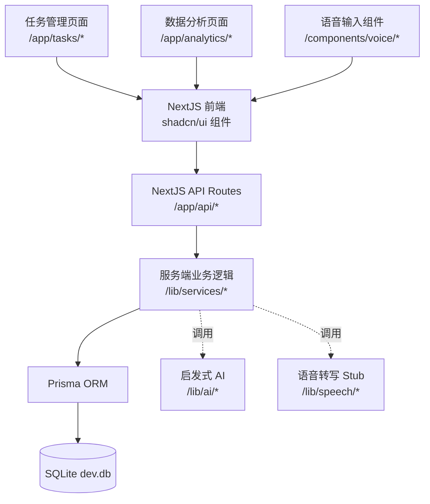
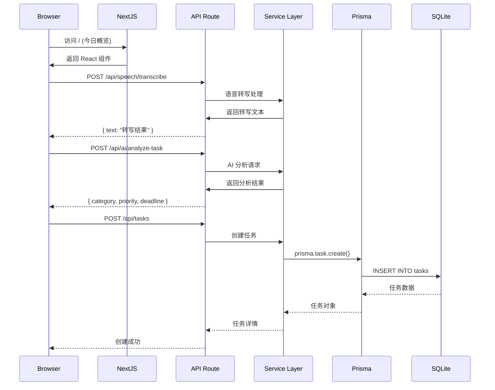

# AI语音管家技术架构文档（Next.js + shadcn/ui + SQLite）

本文面向 Demo/MVP，目标是在 `mona/` 下基于 Next.js 与 shadcn/ui 构建一个全栈 AI 语音管家应用，完成“语音 → 任务 → 分析”的最小闭环：

* 前端：Next.js 14（App Router）+ TypeScript + shadcn/ui + Tailwind CSS

* 后端：Next.js Route Handlers（`/app/api/*`）+ 业务 Service 层

* 数据库：Prisma ORM + SQLite（开发期与演示均使用 SQLite）

* 语音：浏览器端 Web Speech API（或 UI Stub）+ 后端转写 Stub

* AI：启发式规则引擎，后续可替换为 LLM

* 范围：不包含用户体系/权限/计费/生产部署

* 目标：架构清晰、可演进，支持快速原型与演示

## 1. 架构总览



关键取舍：统一使用 Next.js 全栈框架；SQLite + Prisma 简化数据落地与迁移；shadcn/ui 提供现代化无锁定组件；AI 先以启发式规则实现可用效果，接口预留以无缝替换为 LLM/STT。

## 2. 技术栈

* 前端框架：Next.js 14（App Router）+ React 18 + TypeScript

* UI 组件：shadcn/ui + Tailwind CSS + Radix UI

* 状态管理：React Hooks + SWR（客户端数据获取）

* 后端服务：Next.js Route Handlers（`/app/api/*`）

* 数据库：Prisma ORM + SQLite（仅 SQLite）

* 语音处理：Web Speech API（浏览器端）+ 语音转写 Stub（后端）

* AI 分析：启发式规则（关键词驱动分类/优先级/期限推断）

* 构建工具：Next.js Build + Turbopack（本地）

* 类型安全：TypeScript + Prisma Client

与《产品需求文档》的对应关系：

* 今日概览：语音/文字记录任务 + 当日任务清单

* 任务管理：按状态/优先级/分类筛选与编辑

* 数据分析：完成率、趋势、类别对比等可视化

## 3. 目录结构

```
mona/
├── app/                    # NextJS 应用目录
│   ├── api/               # API Routes
│   │   ├── tasks/         # 任务相关 API
│   │   │   ├── route.ts   # GET, POST /api/tasks
│   │   │   └── [id]/      # 单个任务操作
│   │   ├── ai/            # AI 分析 API
│   │   │   └── analyze-task/route.ts
│   │   └── speech/        # 语音转写 API
│   │       └── transcribe/route.ts
│   ├── tasks/             # 任务管理页面
│   │   ├── page.tsx       # 任务列表页面
│   │   └── [id]/page.tsx  # 任务详情页面
│   ├── analytics/         # 数据分析页面
│   │   └── page.tsx       # 执行力分析
│   └── page.tsx           # 今日概览（首页）
├── components/            # 组件目录
│   ├── ui/               # shadcn/ui 基础组件
│   ├── voice/            # 语音输入组件
│   │   ├── VoiceInput.tsx
│   │   └── VoiceButton.tsx
│   ├── tasks/            # 任务相关组件
│   │   ├── TaskList.tsx
│   │   ├── TaskCard.tsx
│   │   └── TaskForm.tsx
│   └── analytics/        # 数据分析组件
│       ├── TaskChart.tsx
│       └── StatsCard.tsx
├── lib/                   # 工具库
│   ├── prisma.ts         # Prisma 客户端
│   ├── services/         # 业务逻辑
│   │   ├── taskService.ts
│   │   ├── aiService.ts
│   │   └── speechService.ts
│   ├── utils/            # 工具函数
│   │   ├── date.ts
│   │   └── constants.ts
│   └── types/            # TypeScript 类型
│       └── task.ts
├── prisma/               # Prisma 配置
│   ├── schema.prisma     # 数据库模型
│   └── migrations/       # 数据迁移
└── public/               # 静态资源
    └── audio/            # 示例音频文件
```

页面与组件映射（结合 shadcn/ui）：

* 今日概览（`/`）：`<VoiceInput />`、`<TaskList todayOnly />`、`Card`、`Button`、`Textarea`、`Badge`

* 任务管理（`/tasks`）：`<TaskList />`、`<TaskForm />`、`<TaskCard />`、`Tabs`、`Select`、`Dialog`、`DropdownMenu`

* 数据分析（`/analytics`）：`<TaskChart />`、`<StatsCard />`、`Card`、`Progress`、`Tooltip`

## 4. 数据模型（Prisma Schema）

```prisma
// prisma/schema.prisma

generator client {
  provider = "prisma-client-js"
}

datasource db {
  provider = "sqlite"
  url      = "file:./dev.db"
}

model Task {
  id            String    @id @default(cuid())
  content       String    // 任务内容
  category      String    // 分类：work / study / life
  priority      Int       // 优先级：1-5
  status        String    // 状态：pending / in_progress / completed / cancelled
  deadline      DateTime? // 截止时间（可选）
  completedAt   DateTime? // 完成时间
  createdAt     DateTime  @default(now())
  updatedAt     DateTime  @updatedAt
  
  @@map("tasks")
}
```

**字段语义说明：**

* `category`：任务分类（工作/学习/生活）

* `priority`：优先级，1（最低）- 5（最高）

* `status`：任务状态枚举

* `deadline`：截止时间，AI 启发式推断

* `completedAt`：完成时间，用于统计分析

索引与查询建议：

* 常用筛选字段：`status`、`category`、`deadline`（可后续添加复合索引）。

* 今日视图查询：`WHERE date(deadline) = date('now') OR status = 'pending'`。

## 5. 关键流程



## 6. API Routes（NextJS）

### 任务管理 API

* `GET /api/tasks` - 获取任务列表

  * 查询参数：`?status=pending&category=work&sort=priority`

  * 返回：`{ tasks: Task[], total: number }`

* `POST /api/tasks` - 创建新任务

  * 请求体：`{ content: string, category?: string, priority?: number, deadline?: string }`

  * 返回：`{ task: Task }`

* `GET /api/tasks/[id]` - 获取任务详情

  * 返回：`{ task: Task }`

* `PATCH /api/tasks/[id]` - 更新任务

  * 请求体：`{ status?: string, priority?: number, deadline?: string, content?: string }`

  * 返回：`{ task: Task }`

* `DELETE /api/tasks/[id]` - 删除任务

  * 返回：`{ success: boolean }`

### AI 分析 API

* `POST /api/ai/analyze-task` - AI 任务分析

  * 请求体：`{ text: string }`

  * 返回：`{ category: string, priority: number, deadline?: string, tags: string[] }`

### 语音转写 API

* `POST /api/speech/transcribe` - 语音转文字（Stub）

  * 请求体：`{ audio?: Blob, mode?: 'demo' }`

  * 返回：`{ text: string, confidence: number }`

### 数据分析 API

* `GET /api/analytics/summary` - 获取执行概览

  * 返回：`{ totalTasks: number, completedRate: number, trends: Trend[] }`

* `GET /api/analytics/chart` - 获取图表数据

  * 查询参数：`?period=week&groupBy=category`

  * 返回：`{ labels: string[], datasets: Dataset[] }`

## 7. 快速开始（mona/）

基础要求：Node.js 18+，安装依赖于 `mona/` 目录执行。

初始化与运行：

1. 安装依赖与 UI 组件

```
cd mona
npm install
# 可选：安装常用 shadcn 组件（示例）
# npx shadcn@latest add button input textarea card badge dialog tabs select dropdown-menu tooltip progress
```

1. 初始化 Prisma（SQLite）并创建数据库

```
npx prisma init --datasource-provider sqlite
# 确认 prisma/schema.prisma 与本文一致
npx prisma migrate dev --name init
```

1. 运行开发服务器

```
npm run dev
# 访问 http://localhost:3000
```

可选：生成 Prisma Client 类型

```
npx prisma generate
```

目录与命名约定：

* API 使用 Route Handlers（`app/api/.../route.ts`）。

* 组件采用 PascalCase，文件名与组件名保持一致。

* 服务层统一从 `lib/services/*` 暴露方法，API 仅做 IO 解析与错误处理。

## 8. 配置与约定

### 环境变量

```bash
# 数据库配置
DATABASE_URL="file:./dev.db"

# AI 配置（可选）
OPENAI_API_KEY="sk-..."  # 后续扩展使用
```

### 开发约定

* TypeScript 严格模式：启用 `strict` 确保类型安全

* UI 与交互：优先使用 shadcn/ui 组件，保持一致的无障碍特性（Radix）

* API 路由：使用 Route Handlers，统一错误格式 `{ error: { code, message } }`

* 数据库操作：通过 Prisma Client，避免拼接原生 SQL

* 时间处理：使用 `date-fns`，统一序列化与时区策略（默认本地时区）

## 9. 与产品需求的功能对齐

根据《AI语音管家产品需求文档》：

* 角色与权限：MVP 阶段不实现注册/登录，所有功能面向单用户本地演示。

* 页面与模块：

  * 今日概览：语音转文字 + 任务快速创建与今日清单展示。

  * 任务管理：状态切换（待完成/已完成/未完成）、AI 自动排序 + 手动拖拽（后续）。

  * 数据分析：完成率、趋势图、分类统计（以任务完成时间与状态聚合）。

* AI 处理链路：文本解析 → 分类判断（工作/学习/生活）→ 紧急程度评估（长期/短期）→ 优先级排序 → 返回处理结果。

## 10. 演进与扩展点

* 语音转写：将后端 Stub 替换为真实 STT（如 OpenAI Whisper、Deepgram）。

* LLM 能力：在 `lib/ai/` 中替换启发式为可配置的 LLM 调用，保留相同输出结构。

* 数据持久化：从 SQLite 平滑迁移至 Postgres（仅需调整 Prisma datasource 与迁移）。

* 多用户支持：引入 Auth（NextAuth/自研）、多租户字段（如 `userId`）。

* 前端性能：列表虚拟化、并行数据获取、图表懒加载。

- **错误处理**：统一返回 `{ error: string, details?: any }`

- **加载状态**：使用 React Suspense 和加载骨架屏

- **表单验证**：使用 zod 进行运行时类型验证

## 8. 运行说明（本地开发）

### 环境准备

```bash
# 1. 创建 NextJS 项目（使用 mona 目录）
cd mona
npx create-next-app@latest . --typescript --tailwind --app --src-dir --import-alias "@/*"

# 2. 安装核心依赖
npm install prisma @prisma/client
npm install date-fns zod
npm install lucide-react  # 图标库
npm install recharts     # 图表库

# 3. 初始化 Prisma
npx prisma init

# 4. 安装 shadcn/ui
npx shadcn-ui@latest init
npx shadcn-ui@latest add button card form input select tabs
npx shadcn-ui@latest add dialog toast  # 交互组件
```

### 数据库设置

```bash
# 1. 编辑 prisma/schema.prisma（使用上面的模型定义）

# 2. 创建数据库并生成客户端
npx prisma generate
npx prisma db push

# 3. （可选）安装 Prisma Studio 查看数据
npx prisma studio
```

### 开发启动

```bash
# 启动开发服务器
npm run dev

# 访问应用
open http://localhost:3000

# 查看 API 文档（通过代码中的注释）
# 访问 http://localhost:3000/api/tasks 等端点
```

### 构建和测试

```bash
# 类型检查
npm run type-check

# 代码检查
npm run lint

# 构建生产版本
npm run build

# 启动生产服务器
npm start
```

## 9. 可扩展性与演进

### 短期扩展（1-2 周）

* **用户体系**：添加 NextAuth.js 支持多平台登录

* **响应式设计**：移动端适配，PWA 支持

* **语音优化**：集成 Web Speech API，提升识别准确率

* **数据可视化**：添加更多图表类型和筛选条件

### 中期扩展（1-2 月）

* **AI 能力升级**：接入 LLM（OpenAI/Kimi）提升分析准确性

* **语音转写**：集成 Whisper 或第三方 STT 服务

* **任务提醒**：添加通知系统和定时提醒

* **数据导出**：支持 Excel、CSV 格式导出

### 长期演进（3-6 月）

* **数据库升级**：迁移到 PostgreSQL，支持更复杂查询

* **性能优化**：添加 Redis 缓存，数据库索引优化

* **团队协作**：支持多人共享任务和权限管理

* **移动应用**：开发 React Native 移动端

* **数据分析**：添加机器学习预测和智能建议

### 技术栈升级

* **状态管理**：引入 Zustand 或 Redux Toolkit

* **API 优化**：使用 tRPC 替代 REST API

* **部署方案**：Vercel/Netlify 部署，添加 CI/CD

* **监控日志**：接入 Sentry、LogRocket 等监控工具

* **测试覆盖**：添加单元测试和 E2E 测试

***

## 当前状态

### 已规划

* 完整的技术架构设计

* 数据库模型和 API 设计

* 开发和部署流程

* 扩展性演进路线

### 待实现

* NextJS 项目初始化

* shadcn/ui 组件集成

* Prisma 数据库设置

* 核心功能开发

* 产品需求对应的页面实现

### 下一步建议

1. 按照第 8 章节初始化项目
2. 创建基础页面结构和路由
3. 实现数据库模型和 API
4. 集成语音输入组件
5. 开发任务管理和数据分析功能


## 附录：MVP 补充说明（Prisma 与最小创建流程）

- 环境变量与数据库位置（建议）
  - 在 mona/.env 中新增：
    - DATABASE_URL="file:./prisma/dev.db"
  - 在 prisma/schema.prisma 中使用 env("DATABASE_URL")，便于不同环境切换。

- Prisma 客户端（单例）
  - 新增文件 mona/lib/prisma.ts：导出全局复用的 PrismaClient，避免 Next.js 热更新导致的连接泄露。

- 最小 API（手动添加任务）
  - GET /api/tasks：返回任务列表（默认按 createdAt desc）。
  - POST /api/tasks：创建任务，请求体最小字段：{ content: string, category?: string, priority?: number, deadline?: string }。

- 前端与后端字段映射（MVP 简化约定）
  - 标题/描述 → content：可将「标题 +（可选描述）」合并为一条 content 存储。
  - 优先级：UI（高/中/低）→ DB（5/3/1）。
  - 分类：UI（工作/学习/生活）→ DB：直接存中文字符串（后续可标准化为 work/study/life）。
  - 截止日期：UI（YYYY-MM-DD）→ DB（DateTime，按本地时区 00:00:00 生成日期）。
  - 状态：UI（todo/done）↔ DB（pending/completed）。

- 运行步骤（最小闭环）
  1) 安装依赖：pnpm add -D prisma && pnpm add @prisma/client
  2) 创建 .env 与 prisma/schema.prisma，执行：pnpm dlx prisma generate && pnpm dlx prisma migrate dev -n init
  3) 新增 API：/app/api/tasks/route.ts 实现 GET/POST
  4) 前端在首页（今日概览）或任务页，使用 fetch('/api/tasks') 获取列表，POST 创建后刷新列表。

