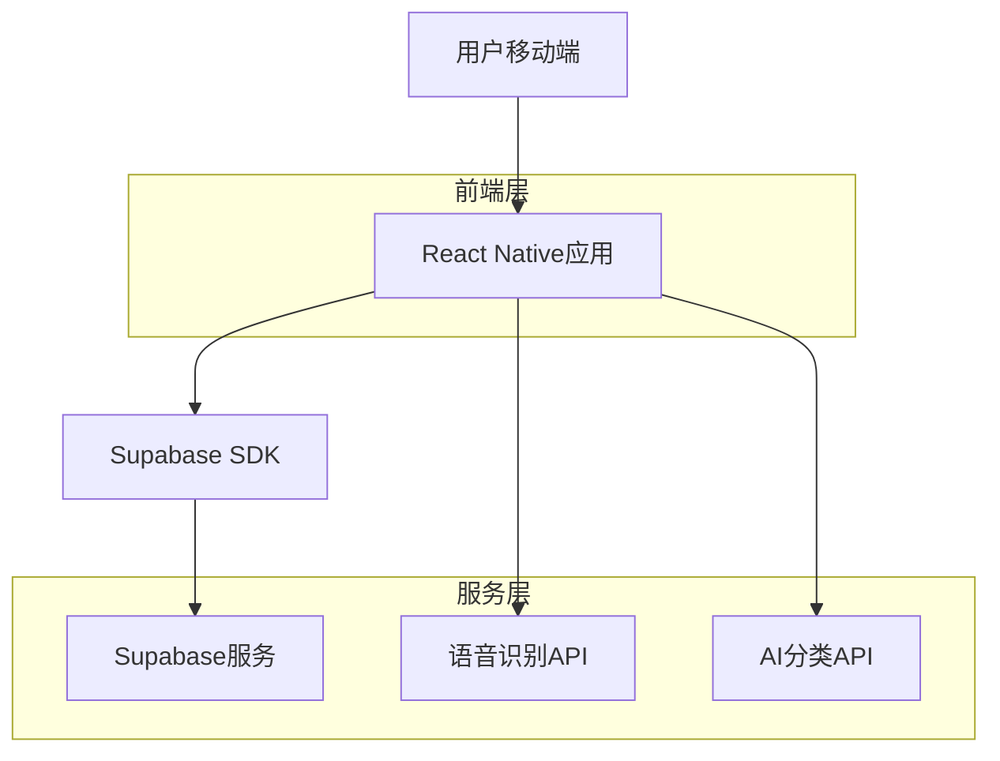
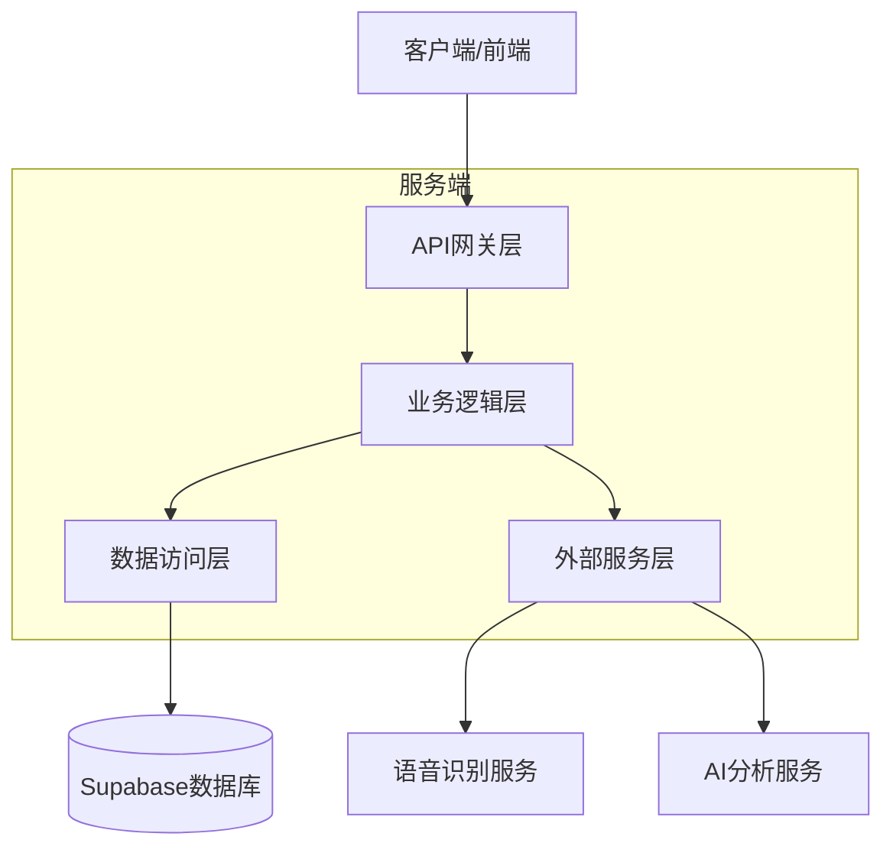
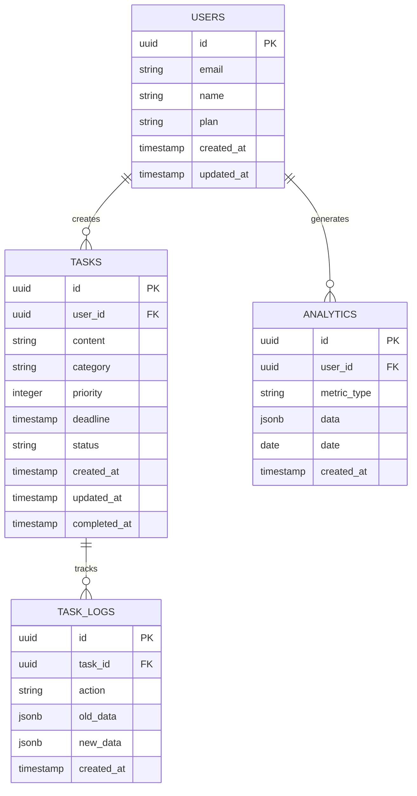

# AI语音管家技术架构文档

## 1. 架构设计



## 2. 技术描述

* 前端：React Native + TypeScript + React Navigation + Expo

* 后端：Supabase（认证、数据库、实时订阅）

* 语音服务：百度语音识别API / 讯飞语音API

* AI服务：OpenAI GPT API（任务分类和优先级判断）

* 图表库：Victory Native（数据可视化）

## 3. 路由定义

| 路由         | 用途                |
| ---------- | ----------------- |
| /login     | 登录页面，用户认证入口       |
| /register  | 注册页面，新用户注册        |
| /home      | 任务记录页面，语音和文字输入任务  |
| /tasks     | 任务管理页面，查看和管理分类任务  |
| /analytics | 数据分析页面，执行力报告和趋势分析 |
| /profile   | 个人设置页面，账户管理和偏好设置  |

## 4. API定义

### 4.1 核心API

**任务管理相关**

```
POST /api/tasks
```

请求：

| 参数名称     | 参数类型   | 是否必需  | 描述             |
| -------- | ------ | ----- | -------------- |
| content  | string | true  | 任务内容描述         |
| category | string | false | 任务分类（工作/学习/生活） |
| deadline | string | false | 截止时间（ISO格式）    |
| priority | number | false | 优先级（1-5）       |

响应：

| 参数名称         | 参数类型    | 描述       |
| ------------ | ------- | -------- |
| success      | boolean | 操作是否成功   |
| task\_id     | string  | 创建的任务ID  |
| ai\_category | string  | AI识别的分类  |
| ai\_priority | number  | AI计算的优先级 |

示例：

```json
{
  "content": "明天下午开会准备PPT",
  "deadline": "2024-01-15T14:00:00Z"
}
```

**语音转文字**

```
POST /api/speech/transcribe
```

请求：

| 参数名称        | 参数类型   | 是否必需 | 描述            |
| ----------- | ------ | ---- | ------------- |
| audio\_data | string | true | Base64编码的音频数据 |
| format      | string | true | 音频格式（wav/mp3） |

响应：

| 参数名称       | 参数类型   | 描述      |
| ---------- | ------ | ------- |
| text       | string | 识别的文字内容 |
| confidence | number | 识别置信度   |

**AI任务分析**

```
POST /api/ai/analyze-task
```

请求：

| 参数名称          | 参数类型   | 是否必需  | 描述     |
| ------------- | ------ | ----- | ------ |
| task\_content | string | true  | 任务描述文本 |
| user\_context | object | false | 用户历史偏好 |

响应：

| 参数名称                 | 参数类型   | 描述     |
| -------------------- | ------ | ------ |
| category             | string | 推荐分类   |
| priority             | number | 推荐优先级  |
| deadline\_suggestion | string | 建议截止时间 |
| tags                 | array  | 提取的标签  |

## 5. 服务器架构图



## 6. 数据模型

### 6.1 数据模型定义



### 6.2 数据定义语言

**用户表 (users)**

```sql
-- 创建用户表
CREATE TABLE users (
    id UUID PRIMARY KEY DEFAULT gen_random_uuid(),
    email VARCHAR(255) UNIQUE NOT NULL,
    name VARCHAR(100) NOT NULL,
    plan VARCHAR(20) DEFAULT 'free' CHECK (plan IN ('free', 'premium')),
    created_at TIMESTAMP WITH TIME ZONE DEFAULT NOW(),
    updated_at TIMESTAMP WITH TIME ZONE DEFAULT NOW()
);

-- 创建索引
CREATE INDEX idx_users_email ON users(email);
CREATE INDEX idx_users_plan ON users(plan);

-- 设置权限
GRANT SELECT ON users TO anon;
GRANT ALL PRIVILEGES ON users TO authenticated;
```

**任务表 (tasks)**

```sql
-- 创建任务表
CREATE TABLE tasks (
    id UUID PRIMARY KEY DEFAULT gen_random_uuid(),
    user_id UUID NOT NULL REFERENCES users(id) ON DELETE CASCADE,
    content TEXT NOT NULL,
    category VARCHAR(20) DEFAULT 'life' CHECK (category IN ('work', 'study', 'life')),
    priority INTEGER DEFAULT 3 CHECK (priority BETWEEN 1 AND 5),
    deadline TIMESTAMP WITH TIME ZONE,
    status VARCHAR(20) DEFAULT 'pending' CHECK (status IN ('pending', 'in_progress', 'completed', 'cancelled')),
    created_at TIMESTAMP WITH TIME ZONE DEFAULT NOW(),
    updated_at TIMESTAMP WITH TIME ZONE DEFAULT NOW(),
    completed_at TIMESTAMP WITH TIME ZONE
);

-- 创建索引
CREATE INDEX idx_tasks_user_id ON tasks(user_id);
CREATE INDEX idx_tasks_status ON tasks(status);
CREATE INDEX idx_tasks_category ON tasks(category);
CREATE INDEX idx_tasks_deadline ON tasks(deadline);
CREATE INDEX idx_tasks_priority ON tasks(priority DESC);

-- 设置权限
GRANT SELECT ON tasks TO anon;
GRANT ALL PRIVILEGES ON tasks TO authenticated;
```

**任务日志表 (task\_logs)**

```sql
-- 创建任务日志表
CREATE TABLE task_logs (
    id UUID PRIMARY KEY DEFAULT gen_random_uuid(),
    task_id UUID NOT NULL REFERENCES tasks(id) ON DELETE CASCADE,
    action VARCHAR(50) NOT NULL,
    old_data JSONB,
    new_data JSONB,
    created_at TIMESTAMP WITH TIME ZONE DEFAULT NOW()
);

-- 创建索引
CREATE INDEX idx_task_logs_task_id ON task_logs(task_id);
CREATE INDEX idx_task_logs_created_at ON task_logs(created_at DESC);

-- 设置权限
GRANT SELECT ON task_logs TO anon;
GRANT ALL PRIVILEGES ON task_logs TO authenticated;
```

**分析数据表 (analytics)**

```sql
-- 创建分析数据表
CREATE TABLE analytics (
    id UUID PRIMARY KEY DEFAULT gen_random_uuid(),
    user_id UUID NOT NULL REFERENCES users(id) ON DELETE CASCADE,
    metric_type VARCHAR(50) NOT NULL,
    data JSONB NOT NULL,
    date DATE NOT NULL,
    created_at TIMESTAMP WITH TIME ZONE DEFAULT NOW()
);

-- 创建索引
CREATE INDEX idx_analytics_user_id ON analytics(user_id);
CREATE INDEX idx_analytics_date ON analytics(date DESC);
CREATE INDEX idx_analytics_metric_type ON analytics(metric_type);

-- 设置权限
GRANT SELECT ON analytics TO anon;
GRANT ALL PRIVILEGES ON analytics TO authenticated;

-- 初始化数据
INSERT INTO analytics (user_id, metric_type, data, date)
VALUES 
  ('00000000-0000-0000-0000-000000000000', 'daily_completion', '{"completed": 0, "total": 0, "rate": 0}', CURRENT_DATE),
  ('00000000-0000-0000-0000-000000000000', 'category_stats', '{"work": 0, "study": 0, "life": 0}', CURRENT_DATE);
```

